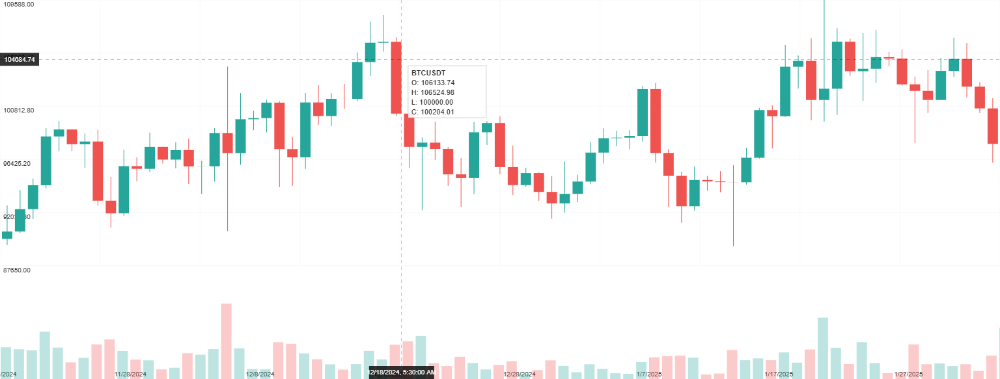
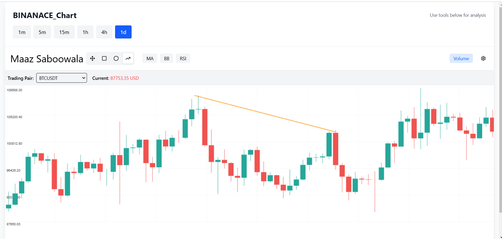
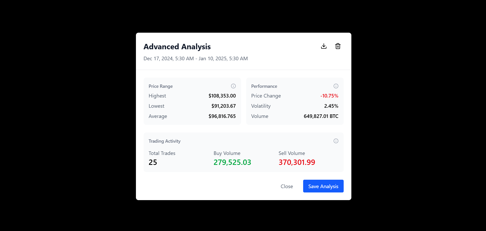

# Crypto Chart Analysis Tool(Tusta Task)
## Trading Chart
  
---
## Custom Shape Line
  
---
## Modal with Analysis and CSV download
  


## 📌 Overview
The **Crypto Chart Analysis Tool** is an interactive cryptocurrency charting application built with **React**. It provides real-time market data visualization, interactive drawing tools, technical indicators, and advanced price analysis capabilities.

## ✨ Features

### 📊 Real-Time Data Visualization
- Live data fetching from **Binance API** with a **10-second refresh interval**.
- Supports multiple **USDT-based trading pairs**.
- **Candlestick chart rendering** with configurable timeframes.
- Volume display support.

### 🛠 Interactive Tools
- **Crosshair tool** with precise price and time information.
- **Tooltip** displaying **OHLC (Open, High, Low, Close) data**.
- **Selection tools** for marking chart areas.

### ✏️ Drawing Tools
- **Rectangle and ellipse** shape drawing.
- **Trend line drawing** for technical analysis.
- **Persistent drawing management**.

### 📈 Technical Analysis
- **Moving Averages (MA) indicator**.
- **Bollinger Bands support**.
- Toggle additional indicators via the UI.

### 🗺 Chart Navigation
- **Pan and zoom** functionality.
- **Scale adjustments** for detailed analysis.
- **Theme switching** (light/dark mode).

### 📡 Analysis Workflow
- Select chart **ranges for in-depth analysis**.
- Send coordinate data to a **Flask backend running on localhost:5000**.
- Receive **start and end coordinates** for analysis.
- Display analysis results in a modal.

## 🏗 Implementation Details

### 🏠 Core Components
- **ChartCanvas**: The main component responsible for rendering and user interactions.
- **Canvas-based rendering** for optimal performance.
- Uses **React hooks** for state management.

### 🔗 API Integration
- Fetches live cryptocurrency market data from **Binance API**.
- Configurable **trading pairs and timeframes**.
- **Flask backend (localhost:5000) for advanced analysis**.

### 🎯 User Interaction
- **Mouse-based drawing and selection tools**.
- **Wheel events for zoom functionality**.
- **Drag operations for smooth chart navigation**.

### 🎨 Styling
- Fully **responsive design**.
- **Theme-aware rendering** (light/dark mode).
- Styled using **TailwindCSS**.

## 🛠 Technical Architecture

### 🔄 Data Flow
1. Fetch available **trading pairs** from Binance.
2. Retrieve **candlestick data** for the selected pair and timeframe.
3. Process and **render data on the canvas**.
4. Handle **user interactions and drawing operations**.
5. Send selected data to the **Flask backend (localhost:5000)** for analysis.
6. Receive **start and end coordinates** and display results in a modal.

### 🛠 Utility Functions
- **drawingUtils.js**: Functions for shape rendering and hit detection.
- **chartUtils.js**: Implements technical indicator calculations (**MA, Bollinger Bands**).

### 🧑‍💻 State Management
- Uses **React useState** and **useEffect** for managing component states.
- **Prop drilling** for passing state between components.

## 🚀 Usage

### 🔍 Chart Navigation
- **Drag** to pan the chart.
- Use the **mouse wheel** to zoom in/out.
- Select a **trading pair** from the dropdown menu.

### ✏️ Drawing Tools
1. Choose a **drawing tool** (rectangle, ellipse, trend line).
2. Click and drag on the chart to create the shape.
3. Release to complete the drawing.
4. Selected areas can be sent for **analysis via the Flask backend**.

### 📊 Technical Analysis
- **Toggle indicators** via the controls.
- **Adjust timeframes** for different market perspectives.
- Use the **crosshair** for precise price/time readings.

## ⚙️ Setup and Installation

### 🔧 Dependencies
- **React** framework
- **react-toastify** for notifications
- **TailwindCSS** for styling
- **Flask backend** (localhost:5000) for advanced analysis

### 🔗 API Requirements
- **Binance API** access for market data.
- **Flask backend running on port 5000** for coordinate-based analysis.

### 🔨 Installation
1. Clone the repository:
   ```bash
   git clone https://github.com/MaazS07/tusta_frontend.git
   cd frontend
   ```
2. Install dependencies:
   ```bash
   npm install
   ```
3. Start the React app:
   ```bash
   npm run dev
   ```
4. Run the Flask backend (in a separate terminal):
   ```bash
   cd flask( different repository)
   pip install -r requirements.txt
   python app.py
   ```

## 🔮 Future Enhancements
- **Additional technical indicators** for deeper insights.
- **Pattern recognition** for automated trend detection.
- **Strategy backtesting** for historical trade simulations.
- **Custom alert functionality** for price movements.
- **Chart annotations and notes** for enhanced analysis.


## 📬 Contact
For any inquiries, feel free to reach out:
- **Email**: maazsaboowala07@gmail.com


